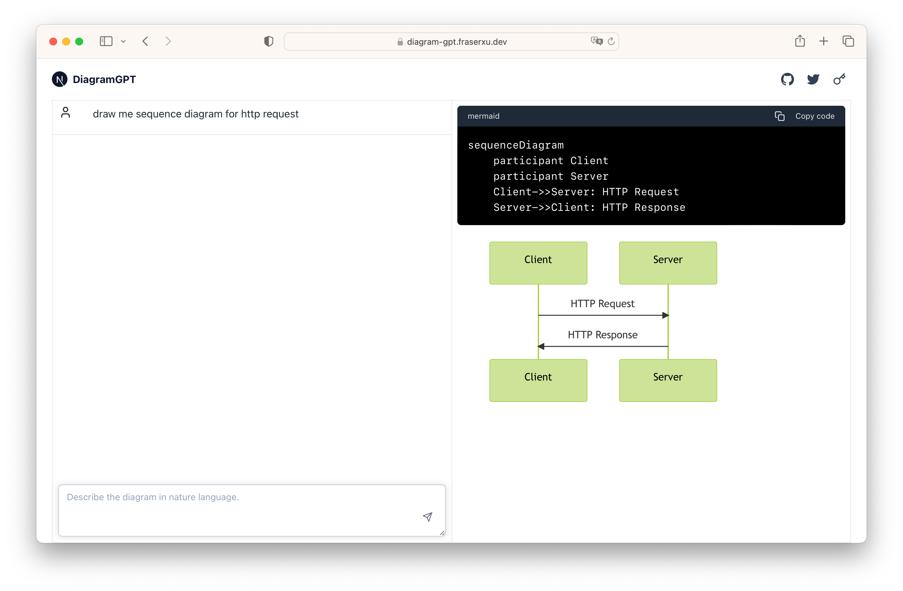

# Diagram GPT

Draw flowchart, sequence diagram, class diagram, user journey, gantt, C4C diagram with nature language.



## Getting Started

First, run the development server:

```bash
npm run dev
# or
yarn dev
# or
pnpm dev
```

Open [http://localhost:3000](http://localhost:3000) with your browser to see the result.

## Credit

* [Next.js](https://nextjs.org/)
* [UI](https://ui.shadcn.com/) by shadcn
* [Mermaid.js](https://mermaid.js.org/)
